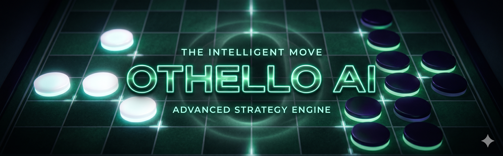
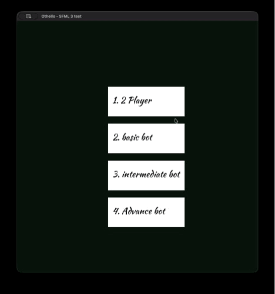
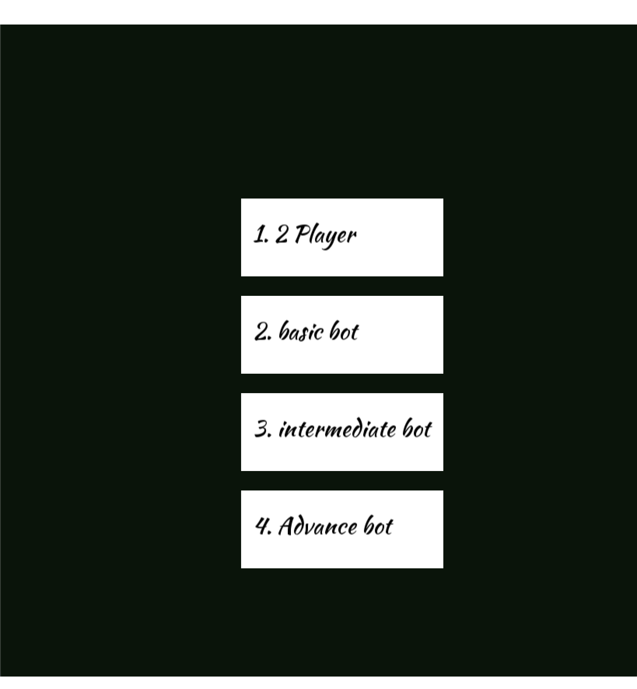

# Othello AI

> A fully-featured Othello (Reversi) game with a multi-tier AI engine — play against intelligent bots or a friend, all rendered with a clean SFML interface.


---



---

## 🎬 Demo



---

## 📖 About the Project

Othello AI is a complete implementation of the classic board game Othello (Reversi) built in C++20. The project features a full game engine with undo/redo history, a polished SFML graphical interface, and a terminal-mode fallback — but the heart of the project is its layered AI system.

Three AI difficulty tiers are available: a fast greedy heuristic, a minimax agent with alpha-beta pruning, and an advanced agent that adds corner capture, disk stability, and frontier analysis to the evaluation function. Each tier uses the same search backbone but progressively richer evaluation, making the difficulty curve feel natural and fair.

---

## ✨ Key Features

- **Three AI Difficulty Tiers** — Basic (Greedy), Intermediate (Minimax α-β, depth 4), and Advanced (Heuristic Minimax α-β, depth 7)
- **Alpha-Beta Pruning** — Move ordering by positional weights accelerates search and cuts branches efficiently
- **Rich Evaluation Function** — Advanced agent weighs coin parity, mobility, corner capture, corner proximity penalty, stable discs, and frontier discs
- **Full Undo Support** — Undo a single move in 2-player mode; undo both bot + player move in AI mode (`U` key)
- **Complete Move History** — Every board state is saved; the terminal mode can print the full game log
- **SFML GUI + Terminal Mode** — Swap between a graphical window or a text-based terminal interface by toggling `main.cpp`
- **Stable Disc Detection** — Iterative propagation algorithm correctly identifies stable discs on all four axes
- **Random Side Assignment** — When playing against a bot, Black/White is assigned randomly at the start

---

## 🛠️ Tech Stack

| Layer        | Technology                          |
| ------------ | ----------------------------------- |
| Language     | C++ 20                              |
| Build System | CMake 3.31+                         |
| Graphics     | SFML 3.0 (Graphics, Window, System) |
| AI Search    | Minimax + Alpha-Beta Pruning        |
| Architecture | Static libraries per module         |

---

## ⚙️ Getting Started

### Prerequisites

- **C++20** compatible compiler (GCC 12+, Clang 14+, or MSVC 2022+)
- **CMake** 3.31 or higher
- **SFML 3.0** installed on your system

#### Installing SFML 3.0

**macOS (Homebrew):**

```bash
brew install sfml
```

**Ubuntu / Debian:**

```bash
sudo apt-get install libsfml-dev
```

**Windows:**  
Download from [sfml-dev.org](https://www.sfml-dev.org/download.php) and follow the CMake integration guide.

---

### Installation

```bash
# 1. Clone the repository
git clone https://github.com/azurvane/othello.git
cd othello

# 2. Create a build directory
mkdir build && cd build

# 3. Configure with CMake
cmake ..

# 4. Build
cmake --build .

# 5. Run
./othello
```

> **Note:** The `assets/` folder is automatically copied to the build directory by CMake post-build. Ensure the font file exists at `assets/fonts/Kaushan_Script/KaushanScript-Regular.ttf` before running.

---

### Switching to Terminal Mode

To run the game without SFML in the terminal, open `main.cpp` and swap the active `main` function:

```cpp
// Comment this out:
// int main() {
//     DisplayEngine display;
//     display.Run();
//     return 0;
// }

// Uncomment this:
int main() {
    TerminalDisplay display;
    display.Run();
    return 0;
}
```

Then rebuild with `cmake --build .`

---

## 🎮 Usage

### Main Menu




On launch you'll see four options:

| Option                  | Description                                           |
| ----------------------- | ----------------------------------------------------- |
| **1. 2 Player**         | Local two-player mode, no AI                          |
| **2. Basic bot**        | Greedy AI — picks the move that flips the most discs  |
| **3. Intermediate bot** | Minimax α-β at depth 4 with positional heuristics     |
| **4. Advance bot**      | Minimax α-β at depth 7 with full strategic evaluation |

### In-Game Controls

| Input          | Action                                     |
| -------------- | ------------------------------------------ |
| **Left Click** | Place a disc on a valid (highlighted) cell |
| **U**          | Undo last move                             |
| **R**          | Reset the current game                     |
| **M**          | Return to Main Menu                        |
| **Q**          | Quit the application                       |

### Terminal Mode Controls

When running in terminal mode, enter moves as a row letter and column number:

```
enter the move (row, col)
u for undo
r for reset
m for main menu
q for quit

> A 3
```

---

## 🧠 AI Architecture

The AI system is structured in three layers built on a shared base:

```
MinimaxAlphabetaBase        ← shared search engine + basic heuristics
    ├── MinimaxAlphabeta    ← intermediate agent (depth 4)
    └── HeuristicMinimaxAlphabeta  ← advanced agent (depth 7, richer eval)
Greedy                      ← basic agent (no search tree)
```

### Evaluation Components

| Component        | Weight (Advanced) | Description                                       |
| ---------------- | ----------------- | ------------------------------------------------- |
| Corner Capture   | ×30               | Reward/penalise owning corners                    |
| Stability        | ×15               | Ratio of unflippable discs                        |
| Mobility         | ×5                | Ratio of available legal moves                    |
| Frontier Discs   | −10               | Penalise discs exposed to empty cells             |
| Corner Proximity | −12               | Penalise occupying X/C squares near empty corners |

---

## 📁 Project Structure

```
othello-ai/
├── main.cpp
├── CMakeLists.txt
├── assets/
│   └── fonts/
├── game_logic/
│   ├── GameEngine.cpp
│   └── GameEngine.h
├── ai_bot/
│   ├── AI.h
│   ├── SelectAIAgent.cpp
│   ├── basic/          (Greedy)
│   ├── intermediate/   (MinimaxAlphabeta)
│   ├── advance/        (HeuristicMinimaxAlphabeta)
│   └── MinimaxAlphabetaBase/
├── display/
│   ├── DisplayEngine.cpp
│   └── DisplayEngine.h
├── terminal_display/
│   ├── TerminalDisplay.cpp
│   └── TerminalDisplay.h
└── data_types/
    ├── DataTypes.h
    └── CommonFunctions.h
```

---

## 📜 License

Distributed under the **MIT License**. See [`LICENSE`](LICENSE) for full terms.

---

## 👤 Author

**azurvane** — [@azurvane](https://github.com/azurvane)
